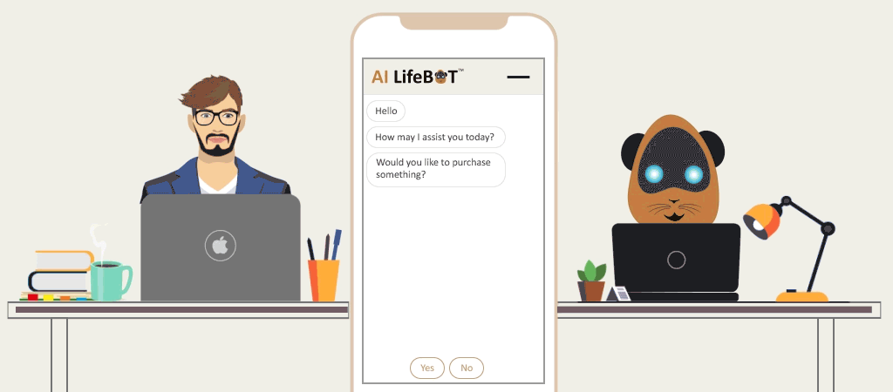

## Hi there 👋 , I’m H@cker Dev!

  

  

  

  

  
    🐍 <b>Node.js</b> | 👩‍💻 <b>Python</b> | 💻 <b>Typescript</b> | 👍 <b>Javascript</b>|📚 <b>Golang</b> | 👍 <b>OpenAI</b> | 📚 <b>LangChain</b> | 📝 <b>Bot     
     Development</b> 
  

# 💫 About Me:

- 🧠 I’m interested in FullStack. Since 2022, I've dived into AI a great interest.
- 👨🏽‍🏫 Currently learning LangChain, Go,& Machine Learning.
- 📚  I’m constantly learning new tools and techniques.
- 💻  I’m looking forward to collaborate with you on interesting projects.
- 🏢 4+ years' experience as a professional software architect.

# 💻 Tech Stack & Language:

 

# 💌Contact me:

     

          
          &nbsp;&nbsp;
          
          &nbsp;&nbsp;

<!---
bmarroc/bmarroc is a ✨ special ✨ repository because its `README.md` (this file) appears on your GitHub profile.
You can click the Preview link to take a look at your changes.
--->
